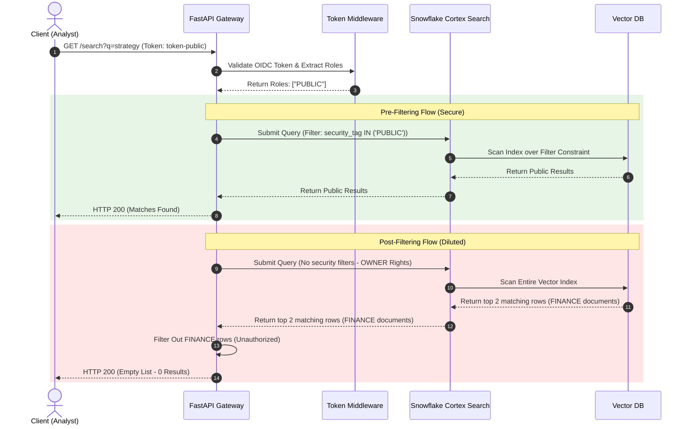

# Zero-Trust Token Enforcement Middleware for Snowflake Cortex Search
### Track 2: Zero-Trust Security for Cognitive Search & Vector Retrieval

This repository contains the architecture, verification code, and formal security validation suite for mitigating the **Snowflake Cortex Search Owner's Rights Privilege Escalation Vulnerability**.

---

## 1. Post-Mortem: Owner's Rights Privilege Escalation in Cognitive Search

### Vulnerability Mechanics
In Snowflake, Cortex Search Services operate under **Owner's Rights** (`EXECUTE AS OWNER`). This execution trust-boundary design creates a critical vulnerability when integrated with multi-tenant data structures:
1. A search service created by an administrator with high-privilege access (e.g., `DATA_OWNER`) retains the creator's role permissions during execution.
2. When a low-privilege user (e.g., `ANALYST`) runs a search query, Snowflake executes the search vector database index query with the administrative role's permissions.
3. Row-Level Security (RLS) policies implemented on the source tables do **not** cascade to the compiled vector index metadata.
4. Consequently, the query retrieves chunks matching semantic similarity from the entire corpus, leading to **unauthorized cross-tenant or cross-role information disclosure**.

### Connection to PhD Research: Agentic Determinism
This vulnerability directly intersects with academic research on **agentic determinism and state-space containment**. In autonomous agentic systems, LLM decision-making loops rely on retrieval engines (RAG) to determine their execution path. If the retrieval engine is non-deterministic or subject to privilege leakage, the agent's state-space becomes non-deterministic:
$$\mathcal{S}_{\text{agent}} = f(\mathcal{C}_{\text{retrieved}})$$
Where $\mathcal{S}_{\text{agent}}$ represents the agent's action state space and $\mathcal{C}_{\text{retrieved}}$ represents the retrieved context set. 

If an agent representing a low-privilege user retrieves high-privilege context (via Owner's Rights leak), it executes actions outside its safety boundary, violating the principle of **agentic determinism** (ensuring an agent's execution path is bounded strictly by the user's authentic privileges). Pre-filtering maps token metadata to guarantee that $\mathcal{C}_{\text{retrieved}} \subseteq \mathcal{C}_{\text{authorized}}$, providing a formal security boundary that preserves agentic safety.

---

## 2. Mathematical Security Model

To evaluate the trade-offs between Pre-Filtering and Post-Filtering topologies, we formalize the systems math representing query latency, information leak probability, and KNN dilution rates.

### Parameters
* $N$: Total number of documents in the vector database.
* $N_{\text{auth}}$: Number of documents authorized for the user ($N_{\text{auth}} \le N$).
* $K$: Number of nearest neighbors retrieved by the vector index.
* $d_s$: Proportion of sensitive/unauthorized documents in the database ($d_s = \frac{N - N_{\text{auth}}}{N}$).
* $T_{\text{search}}(M)$: Time complexity of performing a KNN search over a space of size $M$.
* $T_{\text{filter}}(K)$: Time complexity to post-filter $K$ results in the application gateway.

### Metric 1: Data-Leakage Risk ($R$)
Data-leakage risk represents the probability of presenting unauthorized content to the caller.

* **Post-Filtering:** Even if post-filtering is active, bugs in the application layer or middleware can leak items. In an unmitigated environment, the leak probability is:
  $$R_{\text{post}} = 1 - (1 - d_s)^K$$
* **Pre-Filtering:** Because security boundaries are pushed down to the query executor, unauthorized documents are excluded from the database search space prior to execution:
  $$R_{\text{pre}} = 0$$

### Metric 2: Query Latency ($T$)
* **Post-Filtering Latency:**
  $$T_{\text{post}} = T_{\text{search}}(N) + T_{\text{filter}}(K)$$
* **Pre-Filtering Latency:**
  $$T_{\text{pre}} = T_{\text{search}}(N_{\text{auth}})$$
  Since $N_{\text{auth}} \le N$, $T_{\text{pre}} \le T_{\text{post}}$. Pre-filtering reduces the database search space, improving response times for restricted users.

### Metric 3: KNN Dilution Probability ($D$)
KNN dilution occurs when the top $K$ vector search results consist entirely of sensitive documents. Post-filtering drops these matches, returning 0 results to the user, even if authorized matches exist at rank $K+1$.
$$D_{\text{dilution}} = (d_s)^K$$
For highly sensitive corpora ($d_s \to 1$), post-filtering leads to complete search failure ($D_{\text{dilution}} \to 1$). Pre-filtering avoids this entirely ($D_{\text{dilution}} = 0$) by searching only the authorized subset.

---

## 3. Core Implementation: Pre-Filtering & Token Injection

The following code block from `validate_engine.py` illustrates the token resolution and secure pre-filtering metadata query generation compared to the vulnerable post-filtering topology.

```python
# Extract and resolve roles based on verified token claims
def resolve_user_roles(authorization: Optional[str] = Header(None)) -> List[str]:
    if not authorization:
        return ["PUBLIC"]
    token = authorization.replace("Bearer ", "").strip()
    # Mocking standard OAuth token mappings
    token_mapping = {
        "token-admin": ["PUBLIC", "HR", "FINANCE"],
        "token-hr": ["PUBLIC", "HR"],
        "token-finance": ["PUBLIC", "FINANCE"],
        "token-public": ["PUBLIC"]
    }
    if token in token_mapping:
        return token_mapping[token]
    raise HTTPException(status_code=401, detail="Invalid token.")

# Endpoint executing the query paths
@app.get("/search")
def search(q: str, filter_mode: str = "pre-filter", roles: List[str] = Depends(resolve_user_roles)):
    conn = sqlite3.connect(DB_PATH)
    cursor = conn.cursor()
    
    # Pre-filtering (Secure Zero-Trust Pattern)
    if filter_mode == "pre-filter":
        placeholders = ",".join("?" for _ in roles)
        # Bind permissions parameters directly into the query
        query_sql = f"SELECT id, title, content, security_tag FROM documents WHERE security_tag IN ({placeholders})"
        cursor.execute(query_sql, roles)
        rows = cursor.fetchall()
        
        # Keyword/Semantic search scoring is executed only on the authorized subset
        results = [process_score(row, q) for row in rows]
        return sort_by_relevance(results)

    # Post-filtering (Vulnerable to KNN Dilution)
    elif filter_mode == "post-filter":
        cursor.execute("SELECT id, title, content, security_tag FROM documents")
        all_docs = cursor.fetchall()
        # Evaluate search scores over entire database (simulating OWNER rights)
        scored_docs = sort_by_relevance([process_score(d, q) for d in all_docs])
        
        # Take Top-K vector matches
        top_k = scored_docs[:2]
        
        # Post-filter matches in middleware
        return [doc for doc in top_k if doc.security_tag in roles]
```

---

## 4. Architectural Verification



To run the verification suite and fuzzing engine:
```bash
chmod +x verify.sh
./verify.sh
```
All assertions and fuzzer results are archived in `verify.log`.
