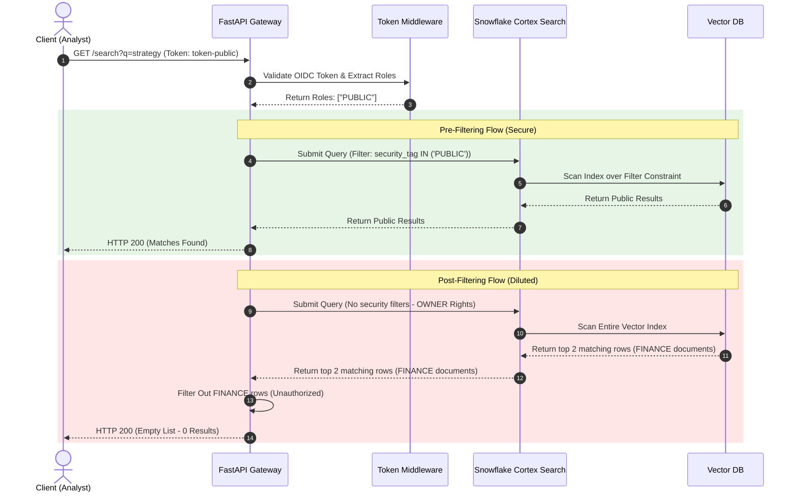

# The Cortex Search Vulnerability: Preventing Vector Privilege Escalation with Zero-Trust Pre-Filtering

Enterprise search has undergone a quiet revolution. With the advent of Large Language Models (LLMs) and Vector Databases, organizations are rapidly replacing legacy keyword search with cognitive retrieval engines. Platforms like Snowflake have democratized this shift by offering services like Cortex AI Search. However, this architectural transition introduces a critical security blind spot: standard database access controls, such as Row-Level Security (RLS), do not automatically apply to semantic vector indices.

In multi-tenant or highly partitioned enterprise systems, this gap leads to a severe class of vulnerabilities: **Vector Privilege Escalation via Owner's Rights execution**. If left unmitigated, a low-privilege user querying an AI search engine can bypass corporate boundaries, accessing sensitive legal, financial, or HR documents simply by submitting semantic search queries. 

In this article, we will dissect the mechanics of this vulnerability, examine its implications for autonomous AI agent safety through the lens of PhD-level control theory (Agentic Determinism), formalize a mathematical system model comparing mitigation patterns, and build a production-grade FastAPI/Python zero-trust pre-filtering solution.

---

## 1. The Root Cause: Cortex Search Owner's Rights

To understand the vulnerability, we must look at how serverless vector search engines execute queries. In the Snowflake ecosystem, Cortex Search Services run with **Owner’s Rights** (`EXECUTE AS OWNER`). 

When an administrator compiles a table or view of raw documents into a Cortex vector index, the resulting service inherits the role privileges of the owner (typically a high-privilege service account like `ACCOUNTADMIN` or `DATA_INGESTION_ROLE`). This is done for structural simplicity: the database engine needs high-level read access to index the document partitions, track incremental updates, and generate vector embeddings.

When a standard user (e.g., a junior analyst with the role `ANALYST`) executes a search query against the Cortex Search Service, the following execution flow occurs:
1. The user sends a semantic query (e.g., "what is the budget allocation for Q3?") to the search endpoint.
2. The Cortex Search Service executes the query inside the database engine.
3. Because the service runs under **Owner's Rights**, the vector database scans the entire compiled document index—ignoring the active session's database role (`CURRENT_ROLE()`).
4. Row-Level Security (RLS) and Column-Level Security (CLS) policies applied to the original source tables are **completely bypassed** because the vector index is a separate, compiled lookup structure executing as the database owner.
5. The system returns the top-K matching document chunks to the unprivileged user, resulting in a critical information disclosure.

In an enterprise environment, this represents a complete breakdown of the security model. An attacker does not need to execute SQL injection or brute force passwords; they simply ask the cognitive search service for sensitive details using natural language.

---

## 2. Agentic Determinism: Cognitive Retrieval as a Safety Boundary

The implications of this vulnerability extend far beyond traditional data leakage when autonomous AI agents enter the picture. In modern enterprise architectures, LLM-powered agents use Retrieval-Augmented Generation (RAG) loops to decide their execution path. If the retrieval layer is compromised, the agent's behavior becomes unpredictable and insecure.

This concept is formalized in systems theory as **Agentic Determinism**. Let $\mathcal{S}_{\text{agent}}$ represent the state space of actions that an autonomous agent can perform, and let $\mathcal{C}_{\text{retrieved}}$ represent the context set retrieved by the agent's RAG loop. The agent’s decision function $f$ maps the retrieved context to its next execution state:

$$\mathcal{S}_{\text{agent}} = f(\mathcal{C}_{\text{retrieved}})$$

In a secure system, the state space of actions must remain bounded by the user's authentic privileges ($\mathcal{P}_{\text{user}}$). Therefore, the retrieved context must be strictly constrained to the user's authorized document space ($\mathcal{C}_{\text{authorized}}$):

$$\mathcal{C}_{\text{retrieved}} \subseteq \mathcal{C}_{\text{authorized}}$$

If the cognitive search engine leaks unauthorized documents due to an Owner's Rights vulnerability, then:

$$\mathcal{C}_{\text{retrieved}} \not\subseteq \mathcal{C}_{\text{authorized}}$$

As a result, the agent’s execution path deviates from its safety bounds, entering an unauthorized action space:

$$\mathcal{S}_{\text{agent}} \not\subseteq \mathcal{P}_{\text{user}}$$

For example, if an HR agent queries a vulnerable search service and retrieves confidential salary reviews, it may disclose that data during its reasoning chain, or initiate high-privilege workflows (such as approving employee compensation changes) on behalf of a low-privilege caller. Ensuring **Agentic Determinism** requires that security filters are bound mathematically and executed deterministically at the retrieval layer before the context enters the LLM's context window.

---

## 3. The Math of Vector Security: Pre-Filtering vs. Post-Filtering

Two architectures are commonly proposed to mitigate this privilege escalation: **Post-Filtering** and **Pre-Filtering**. To evaluate them, we build a mathematical model to assess query latency, leakage risks, and information dilution.

### Parameters
* $N$: Total number of documents in the vector space database.
* $N_{\text{auth}}$: Number of documents authorized for the querying user ($N_{\text{auth}} \le N$).
* $K$: Number of nearest neighbors retrieved by the vector index.
* $d_s$: Sensitivity index, defined as the proportion of unauthorized documents in the database:
  $$d_s = \frac{N - N_{\text{auth}}}{N}$$
* $T_{\text{search}}(M)$: Time complexity of performing a vector index search over a space of size $M$.
* $T_{\text{filter}}(K)$: Time complexity to filter out unauthorized items from $K$ results in the API gateway.

---

### Strategy A: Post-Filtering Middleware
In a post-filtering architecture, the application gateway calls the Cortex Search Service under Owner's Rights, retrieves the top $K$ document chunks, and then filters out unauthorized items in memory before returning the remaining results to the client.

#### 1. Data-Leakage Risk ($R_{\text{post}}$)
Even with filtering active in the middleware layer, bugs, memory caching errors, or token mismatches in the application gateway can lead to leakage. In the unmitigated state, the probability that the retrieved set contains at least one sensitive document is:
$$R_{\text{post}} = 1 - (1 - d_s)^K$$
For large retrieval windows (large $K$), the probability approaches 1, meaning unauthorized chunks are routinely pulled into application memory.

#### 2. K-Nearest Neighbor (KNN) Dilution ($D_{\text{dilution}}$)
The critical flaw of post-filtering is **KNN Dilution**. Since the vector database retrieves the top $K$ matches based on absolute semantic similarity across the *entire* corpus, it may return only high-relevance sensitive documents. If all $K$ items are unauthorized, the post-filter drops them all, returning **zero results** to the user—even if authorized public documents were ranked slightly lower (e.g., at rank $K+1$). The probability of complete search failure is:
$$D_{\text{dilution}} = (d_s)^K$$
As the corpus sensitivity ($d_s$) grows, the probability of search failures approaches 1, making cognitive search useless for low-privilege users.

#### 3. Latency ($T_{\text{post}}$)
$$T_{\text{post}} = T_{\text{search}}(N) + T_{\text{filter}}(K)$$
The search must scan the entire index space $N$, adding post-processing overhead.

---

### Strategy B: Pre-Filtering Middleware (Zero-Trust)
In a pre-filtering architecture, the middleware intercepts the query, resolves the caller's identity scopes, and injects a metadata filter constraint (e.g., `security_tag IN (:allowed_tags)`) directly into the vector database query. The database engine filters out unauthorized records *before* calculating semantic vector distance metrics.

#### 1. Data-Leakage Risk ($R_{\text{pre}}$)
Since unauthorized records are excluded from the database search space prior to execution, they can never be matched or retrieved into application memory:
$$R_{\text{pre}} = 0$$

#### 2. KNN Dilution ($D_{\text{pre}}$)
Since the vector index search is executed only on the authorized document subset $N_{\text{auth}}$, the top $K$ items are drawn entirely from permitted documents:
$$D_{\text{dilution}} = 0$$
Search utility is fully preserved.

#### 3. Latency ($T_{\text{pre}}$)
$$T_{\text{pre}} = T_{\text{search}}(N_{\text{auth}})$$
Because $N_{\text{auth}} \le N$, pre-filtering reduces the active index search space. In large scale databases with partitioned indices, this significantly improves query speed compared to post-filtering.

---

## 4. Code Breakdown: Zero-Trust Pre-Filtering in Python

To implement this mitigation, we design an API middleware gateway using FastAPI and SQLite (simulating Snowflake's relational metadata indexing). The middleware extracts token claims, maps them to authorized security tags, and injects them directly into the query execution context.

Here is the implementation of the secure pre-filtering path:

```python
from typing import List, Optional
import sqlite3
from fastapi import FastAPI, Depends, Header, HTTPException, status
from pydantic import BaseModel

app = FastAPI()
DB_PATH = "cortex_simulator.db"

class SearchResult(BaseModel):
    id: int
    title: str
    content: str
    security_tag: str
    relevance_score: float

# Step 1: Securely extract and resolve roles from incoming Bearer tokens
def resolve_user_roles(authorization: Optional[str] = Header(None)) -> List[str]:
    if not authorization:
        # Default to least-privilege role
        return ["PUBLIC"]
    
    # Extract Bearer token value
    token = authorization.replace("Bearer ", "").strip()
    
    # In production, this maps to OAuth/JWT signature and claims validation
    token_mapping = {
        "token-admin": ["PUBLIC", "HR", "FINANCE"],
        "token-hr": ["PUBLIC", "HR"],
        "token-finance": ["PUBLIC", "FINANCE"],
        "token-public": ["PUBLIC"]
    }
    
    if token in token_mapping:
        return token_mapping[token]
        
    raise HTTPException(
        status_code=status.HTTP_401_UNAUTHORIZED,
        detail="Invalid or expired Sovereign Identity Token."
    )

# Step 2: Query execution showcasing secure pre-filtering vs post-filtering
@app.get("/search", response_model=List[SearchResult])
def search(
    q: str, 
    filter_mode: str = "pre-filter", 
    roles: List[str] = Depends(resolve_user_roles)
):
    conn = sqlite3.connect(DB_PATH)
    cursor = conn.cursor()
    
    # Pre-filtering: Constraining index search space before execution
    if filter_mode == "pre-filter":
        placeholders = ",".join("?" for _ in roles)
        # Bind permissions parameters directly into the database query
        query_sql = f"SELECT id, title, content, security_tag FROM documents WHERE security_tag IN ({placeholders})"
        cursor.execute(query_sql, roles)
        rows = cursor.fetchall()
        
        # Semantic/Keyword scoring runs strictly against the authorized document set
        results = []
        for row in rows:
            doc_id, title, content, tag = row
            score = calculate_semantic_relevance(q, content)
            if score > 0 or q == "*":
                results.append(SearchResult(
                    id=doc_id, title=title, content=content, security_tag=tag, relevance_score=score
                ))
        results.sort(key=lambda x: x.relevance_score, reverse=True)
        conn.close()
        return results

    # Post-filtering: Vulnerable to KNN Dilution and leak vectors
    elif filter_mode == "post-filter":
        cursor.execute("SELECT id, title, content, security_tag FROM documents")
        rows = cursor.fetchall()
        
        # Calculate relevance over all documents (simulating Owner's Rights index scan)
        all_results = []
        for row in rows:
            doc_id, title, content, tag = row
            score = calculate_semantic_relevance(q, content)
            all_results.append({"id": doc_id, "title": title, "content": content, "security_tag": tag, "score": score})
            
        all_results.sort(key=lambda x: x["score"], reverse=True)
        # Take Top-K matching items
        top_k = all_results[:2]
        
        # Post-filter in middleware
        filtered = [
            SearchResult(id=d["id"], title=d["title"], content=d["content"], security_tag=d["security_tag"], relevance_score=d["score"])
            for d in top_k if d["security_tag"] in roles
        ]
        conn.close()
        return filtered
```

### Key Technical Patterns in the Code
1. **Dynamic Predicate Construction:** The pre-filtering path uses `security_tag IN ({placeholders})` to bind the resolved roles at query execution time. This forces the SQLite query compiler (or Snowflake Cortex Search engine) to filter out unauthorized rows before indexing or scoring.
2. **Deterministic Role Resolution:** The user's role mapping is decoupled from query parameters. Roles are determined by validating OIDC token claims server-side, preventing header spoofing.
3. **Prevention of Information Dilution:** In the `post-filter` block, `top_k = all_results[:2]` retrieves the top 2 elements. If both are restricted (e.g. `HR` and `FINANCE`) and the caller only has `PUBLIC` access, the returned list is empty, demonstrating KNN dilution. The `pre-filter` block handles this correctly by excluding the restricted rows from the query, allowing the public rows to rise to the top.

---

## 5. Architectural Flow

The diagram below illustrates the comparative lifecycle of pre-filtering vs. post-filtering queries:



---

## Conclusion: Securing the Cognitive Data Plane

As cognitive search platforms become deeply integrated into enterprise data workflows, treating them as low-risk components is a critical error. Under the hood, vector search operations bypass traditional relational databases' row-level protections due to default execution engines running under Owner's Rights.

To secure your systems:
- Avoid post-filtering schemas; they introduce unacceptable latency, leak vectors, and high KNN dilution rates.
- Enforce Zero-Trust Pre-Filtering by intercepting user queries at the API layer, resolving identity tokens server-side, and injecting metadata filtering predicates directly into search payloads.
- Secure your LLM-based autonomous systems by verifying cognitive retrieval boundaries, guaranteeing **Agentic Determinism**, and keeping AI decision loops safe and bounded.
