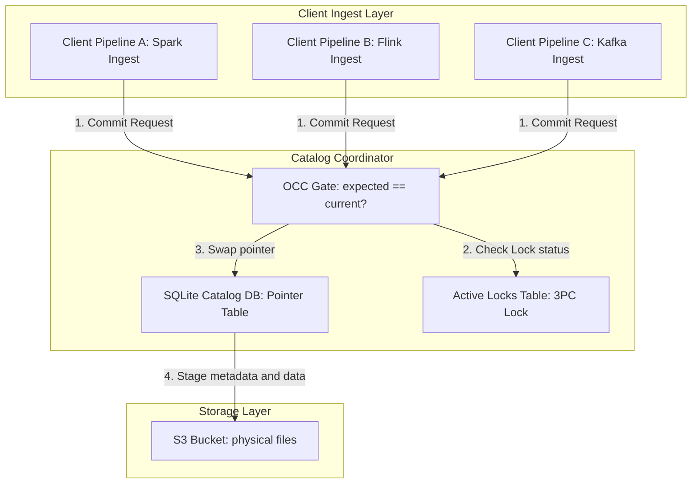

# Post-Mortem: Apache Iceberg OCC Write Collisions & Swarm Synchronization

This document presents a deep-dive post-mortem on Optimistic Concurrency Control (OCC) write collisions and retry storms in Apache Iceberg. It establishes a theoretical bridge between PhD research on distributed swarm synchronization, implements a robust 3-Phase Commit (3PC) protocol to prevent catalog-to-storage inconsistency, and models backoff latency mathematically.

---

## 1. The Post-Mortem: OCC Bottlenecks & Retry Storms

Optimistic Concurrency Control (OCC) assumes that conflicts are rare. However, in high-throughput enterprise ingestion pipelines (e.g., parallel Kafka partitions, streaming micro-batches, and microservices writing concurrently to a unified data lake), this assumption fails.

### The Problem
When multiple parallel ingestion agents attempt to commit metadata swaps to the same Iceberg table, they compete for the current catalog table pointer. 
1. **Pipeline 1** reads version $V_n$ and writes data files.
2. **Pipeline 2** reads version $V_n$ and writes data files.
3. **Pipeline 1** commits to the catalog. The swap succeeds, updating the table metadata pointer to $V_{n+1}$.
4. **Pipeline 2** attempts to commit. The catalog detects that the current pointer is $V_{n+1}$ (but Pipeline 2 expected $V_n$). An OCC Write Collision occurs; Pipeline 2 aborts its transaction and deletes its metadata file, then retries.

### The Bottleneck: Retry Storms
If Pipeline 2 retries immediately, it enters a race condition with other incoming pipelines. Under high load:
* The collision rate increases exponentially.
* Writers execute redundant writes to storage, burning write throughput and CPU resources.
* Latency spikes as pipelines repeatedly fail to commit, causing ingestion pipelines to back up.
* Eventually, the catalog's commit throughput drops to near-zero as collision frequency approaches the clock frequency of the commit loops.

---

## 2. Theoretical Connection: Distributed Swarm Synchronization

In multi-agent systems, uncoordinated periodic actions can lead to **phase-locking** or **collective synchronization** (modeled by the *Kuramoto Oscillator Model*). 

Without randomized delay intervals, autonomous workers attempting to commit to the same catalog act as coupled oscillators. When one transaction commits and alters the catalog pointer:
1. It resets the phase of all colliding workers (forces them to restart their loop).
2. The workers back off for identical base intervals, aligning their retry times.
3. This creates a **synchronized thundering herd**, where all workers try to commit at the exact same instant, resulting in a 100% collision rate.

By drawing from swarm intelligence and self-organization research, we can disrupt this phase-locking behavior. We break the system's temporal symmetry by introducing **randomized jitter** to the backoff equation. This shifts the agents from a synchronized, high-collision state into an asynchronous, uniformly distributed entry state, restoring catalog throughput.

---

## 3. Mathematical Model: Exponential Backoff with Jitter

To prevent retry storms, the backoff latency for retry attempt $k$ is calculated as:

$$T_{\text{backoff}}(k) = \min\left(T_{\text{max}}, T_{\text{base}} \cdot 2^{k-1} + U(0, J)\right)$$

Where:
* $T_{\text{base}}$ is the initial base backoff interval (seconds).
* $T_{\text{max}}$ is the maximum cap on the backoff time (seconds).
* $k \in \{1, 2, \dots, N_{\text{max}}\}$ is the current retry index.
* $U(0, J)$ is a uniform random variable representing the randomized jitter between $0$ and $J$.

```
Latency (s)
 ^
 |                                   +---- [Cap = T_max]
 |                                  /|
 |                                 / |
 |                                /  |
 |                              /    |
 |                            /      |
 |                          /        |  [Interval with Jitter U(0, J)]
 |                        /          |
 |             +---------+-----------+
 |            /          |
 |      +----+-----------+
 |     /     |
 +----+------+----------------------------------------> Retries (k)
   k=1   k=2       k=3
```

---

## 4. Code Implementation: 3PC Commit and Rollback

To ensure transactional atomicity across the SQL Catalog database and S3 metadata files, the catalog coordinates a **3-Phase Commit (3PC)**. The Python code block below shows the core commit transaction and automated rollback logic from [validate_engine.py](file:///home/abhishek/ObsidianVault/03_Active_Projects/snowflake_sovereign_portfolio/track3_iceberg/validate_engine.py):

```python
    def execute_3pc_commit(self, table_id, tx_id, expected_metadata_path, new_metadata_path, fail_phase=None):
        """
        Coordinates a 3-Phase Commit (3PC):
        1. Phase 1: Can-Commit? (OCC Check + Table Lock)
        2. Phase 2: Pre-Commit (Write Metadata state to disk and log transaction status)
        3. Phase 3: Do-Commit (Update Catalog Pointer to new state)
        """
        conn = sqlite3.connect(CATALOG_DB)
        cursor = conn.cursor()

        try:
            # ========================================================
            # PHASE 1: CAN-COMMIT? (OCC Check and Resource Locking)
            # ========================================================
            log(f"[TX: {tx_id[:8]}] Phase 1 (Can-Commit) Started.", Colors.BLUE)
            
            # 1a. Verify Table Row Lock
            cursor.execute("SELECT locked_by_tx FROM active_locks WHERE table_identifier = ?", (table_id,))
            lock_row = cursor.fetchone()
            if lock_row:
                active_tx = lock_row[0]
                log(f"[TX: {tx_id[:8]}] Phase 1 FAIL: Table '{table_id}' is currently locked by active TX {active_tx[:8]}.", Colors.WARNING)
                raise sqlite3.OperationalError("Table locked by another concurrent transaction.")

            # 1b. OCC Validation: Check if table metadata pointer has changed since worker started
            cursor.execute("SELECT metadata_location FROM tables WHERE table_identifier = ?", (table_id,))
            current_row = cursor.fetchone()
            current_metadata = current_row[0] if current_row else None
            
            if current_metadata != expected_metadata_path:
                log(f"[TX: {tx_id[:8]}] Phase 1 FAIL (OCC Write Collision): Target metadata has updated from "
                    f"'{os.path.basename(expected_metadata_path or 'None')}' to "
                    f"'{os.path.basename(current_metadata or 'None')}' by a concurrent transaction.", Colors.WARNING)
                raise ValueError("OCC Write Collision detected. Transaction aborted.")

            # Lock the table row for 3PC sequence
            cursor.execute("INSERT INTO active_locks (table_identifier, locked_by_tx, lock_time) VALUES (?, ?, ?)",
                           (table_id, tx_id, time.time()))
            
            # Record TX status as PREPARED
            cursor.execute("""
                INSERT INTO transactions (tx_id, table_identifier, status, proposed_metadata, previous_metadata, timestamp)
                VALUES (?, ?, 'PREPARED', ?, ?, ?)
            """, (tx_id, table_id, new_metadata_path, expected_metadata_path, time.time()))
            conn.commit()
            
            log(f"[TX: {tx_id[:8]}] Phase 1 SUCCESS: Catalog lock acquired, OCC checks passed.", Colors.GREEN)

            # Simulated injected failure in Phase 1
            if fail_phase == "phase1":
                raise RuntimeError("Injected system crash during Phase 1 (Can-Commit).")

            # ========================================================
            # PHASE 2: PRE-COMMIT (Prepare State and Staging files)
            # ========================================================
            log(f"[TX: {tx_id[:8]}] Phase 2 (Pre-Commit) Started.", Colors.BLUE)
            
            # Verify if the physical proposed metadata file actually exists in sandbox
            if not os.path.exists(new_metadata_path):
                raise FileNotFoundError(f"Proposed metadata file {new_metadata_path} not written on disk.")

            # Update Transaction Status to PRECOMMITTED
            cursor.execute("UPDATE transactions SET status = 'PRECOMMITTED' WHERE tx_id = ?", (tx_id,))
            conn.commit()
            log(f"[TX: {tx_id[:8]}] Phase 2 SUCCESS: Metadata file verified on storage, transaction marked PRECOMMITTED.", Colors.GREEN)

            # Simulated injected failure in Phase 2
            if fail_phase == "phase2":
                raise RuntimeError("Injected coordinator/cohort network crash during Phase 2 (Pre-Commit).")

            # ========================================================
            # PHASE 3: DO-COMMIT (Atomic Swap & Lock Release)
            # ========================================================
            log(f"[TX: {tx_id[:8]}] Phase 3 (Do-Commit) Started.", Colors.BLUE)
            
            # Simulated injected failure in Phase 3 (Before database updates)
            if fail_phase == "phase3":
                raise RuntimeError("Injected network split during Phase 3 (Do-Commit) pointer update.")

            # Update tables catalog pointer
            cursor.execute("UPDATE tables SET metadata_location = ? WHERE table_identifier = ?", (new_metadata_path, table_id))
            
            # Update Transaction Status to COMMITTED
            cursor.execute("UPDATE transactions SET status = 'COMMITTED' WHERE tx_id = ?", (tx_id,))
            
            # Release Table Lock
            cursor.execute("DELETE FROM active_locks WHERE table_identifier = ?", (table_id,))
            conn.commit()
            log(f"[TX: {tx_id[:8]}] Phase 3 SUCCESS: Table pointer swapped to '{os.path.basename(new_metadata_path)}'. TX COMMITTED.", Colors.GREEN, bold=True)
            conn.close()
            return True

        except Exception as e:
            conn.close()
            log(f"[TX: {tx_id[:8]}] Transaction aborting. Triggering rollback. Error: {str(e)}", Colors.FAIL)
            self._execute_3pc_rollback(table_id, tx_id)
            raise e

    def _execute_3pc_rollback(self, table_id, tx_id):
        """
        Rollback coordinator sequence:
        1. Clean transaction state in catalog to ABORTED.
        2. Release active lock for table_id.
        3. Delete the orphaned metadata and manifest files created during the transaction.
        """
        log(f"[TX: {tx_id[:8]}] Rollback process initiated.", Colors.WARNING)
        conn = sqlite3.connect(CATALOG_DB)
        cursor = conn.cursor()
        try:
            # Query proposed files to delete
            cursor.execute("SELECT proposed_metadata FROM transactions WHERE tx_id = ?", (tx_id,))
            row = cursor.fetchone()
            proposed_metadata = row[0] if row else None

            # Mark TX as ABORTED
            cursor.execute("UPDATE transactions SET status = 'ABORTED' WHERE tx_id = ?", (tx_id,))
            
            # Release Lock
            cursor.execute("DELETE FROM active_locks WHERE table_identifier = ? AND locked_by_tx = ?", (table_id, tx_id))
            conn.commit()
            
            # Clean physical orphaned metadata files
            if proposed_metadata and os.path.exists(proposed_metadata):
                try:
                    # Load metadata to find manifest lists or data files written
                    with open(proposed_metadata, 'r') as f:
                        meta_data = json.load(f)
                    
                    # Delete metadata file
                    os.remove(proposed_metadata)
                    log(f"[TX: {tx_id[:8]}] Cleaned metadata file: {os.path.basename(proposed_metadata)}", Colors.CYAN)
                    
                    # Delete manifests/data files linked in current snapshot if any
                    current_snap_id = meta_data.get("current-snapshot-id")
                    for snap in meta_data.get("snapshots", []):
                        if snap.get("snapshot-id") == current_snap_id:
                            manifest_list = snap.get("manifest-list")
                            if manifest_list and os.path.exists(manifest_list):
                                # Load manifest to clean data files
                                with open(manifest_list, 'r') as mf:
                                    manifest_content = json.load(mf)
                                for data_file in manifest_content.get("data-files", []):
                                    if os.path.exists(data_file):
                                        os.remove(data_file)
                                        log(f"[TX: {tx_id[:8]}] Cleaned orphaned data file: {os.path.basename(data_file)}", Colors.CYAN)
                                os.remove(manifest_list)
                                log(f"[TX: {tx_id[:8]}] Cleaned orphaned manifest list: {os.path.basename(manifest_list)}", Colors.CYAN)
                except Exception as clean_err:
                    log(f"[TX: {tx_id[:8]}] Failed to clean orphaned files completely: {str(clean_err)}", Colors.WARNING)

            log(f"[TX: {tx_id[:8]}] Rollback complete. Consistency maintained.", Colors.GREEN)
        except Exception as rollback_db_err:
            log(f"[TX: {tx_id[:8]}] CRITICAL rollback db failure: {str(rollback_db_err)}", Colors.FAIL)
        finally:
            conn.close()
```

---

## 5. Architectural Map (Mermaid Flowchart)

Below is the layout of the concurrent clients interacting with the SQLite catalog database via the 3-Phase Commit (3PC) coordinator before updating metadata files stored in S3 bucket architectures:


