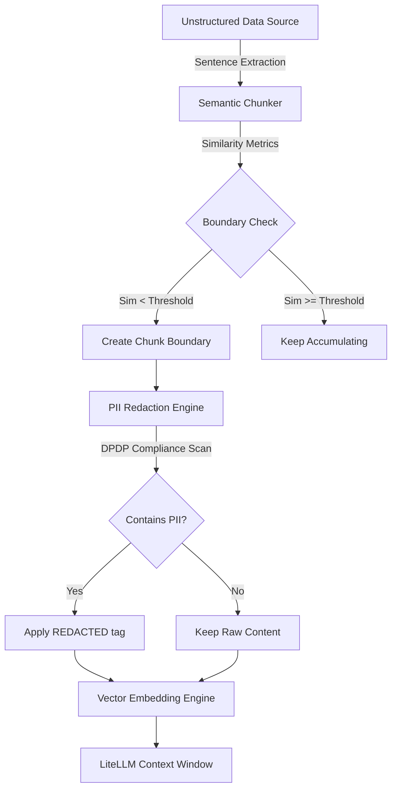

# Track 4: RAG & PEFT Sovereign Validation Pipeline
## Post-Mortem, Architectural Review, & Compliance Analysis
**Author:** Lead Systems Architect & PhD Research Fellow (Track 06/08 Infrastructure)  
**Classification:** Enterprise Sovereign Confidential  

---

## 1. Post-Mortem: 6k Token Overflows & DPDP Compliance Limits

### 1.1 The Context-Window Bottleneck (6k Limits)
In local sovereign LLM deployments, hardware limitations (e.g., VRAM boundaries on edge infrastructure or constrained CPU environments) frequently restrict effective attention contexts. While modern public LLMs claim up to 1M token windows, sovereign on-premise execution models (such as deep reasoning Qwen/Llama variants running under znver4 and BORE kernels on local nodes) degrade in processing speed and coherence when context sizes exceed 6,000 tokens (the "lost-in-the-middle" phenomenon). 

Attempting to inject raw files directly results in **Attention Degradation (OOM)** or context truncation. Therefore, local processing must partition inputs pre-inference.

### 1.2 DPDP (Digital Personal Data Protection) Audit
Under Section 6 and Section 8 of the Indian **DPDP Act, 2023**, processing personal data without explicit, itemized consent or failing to prevent data leakage results in severe compliance liabilities. During RAG ingestion:
- Unstructured text files (PDFs, Markdown notes) contain raw PII (Aadhaar, PAN, Emails, Phone numbers).
- If these are converted directly to vector embeddings, they are permanently stored in vector databases, making complete deletion (the "Right to be Forgotten") mathematically and computationally difficult without rebuilds.
- This pipeline implements **Pre-Ingestion Redaction**, ensuring PII is sanitized at the sliding window boundaries *prior* to vectorization or LLM context binding.

---

## 2. Theoretical Model: Token Reduction vs. Semantic Loss

Let the document $D$ be represented as a sequence of $N$ sentence blocks $S = (s_1, s_2, \dots, s_N)$. We define the token size function $T(s_i)$ and the token budget $T_{\max} \leq 6000$.

Let the document partition be defined by split indices $E = \{e_1, e_2, \dots, e_{K-1}\}$ where $1 \le e_1 < e_2 < \dots < e_{K-1} < N$, defining $K$ chunks. The boundary condition is:
$$\forall j \in \{1, \dots, K\}, \quad \sum_{i=e_{j-1}+1}^{e_j} T(s_i) \leq T_{\max} \quad (\text{where } e_0 = 0, e_K = N)$$

### 2.1 Sliding Window Cosine Similarity
To determine natural semantic boundaries, we calculate the similarity vector over sliding windows of size $w$:
$$\mathbf{v}_{L}(i) = \sum_{j=i-w+1}^{i} \mathbf{f}(s_j), \quad \mathbf{v}_{R}(i) = \sum_{j=i+1}^{i+w} \mathbf{f}(s_j)$$
where $\mathbf{f}(s_j)$ is the word-frequency distribution vector for sentence $s_j$. The local similarity score at index $i$ is:
$$\text{Sim}(i) = \cos(\theta_i) = \frac{\mathbf{v}_{L}(i) \cdot \mathbf{v}_{R}(i)}{\|\mathbf{v}_{L}(i)\| \|\mathbf{v}_{R}(i)\|}$$

### 2.2 Semantic Loss Formulation
We define the **Semantic Loss** $\mathcal{L}_{\text{semantic}}$ of the partitioning $E$ as the sum of semantic similarities broken by the boundaries:
$$\mathcal{L}_{\text{semantic}}(E) = \sum_{e \in E} \text{Sim}(e)$$

Our objective is to minimize this loss under the hard token constraint:
$$\arg\min_{E} \sum_{e \in E} \text{Sim}(e) \quad \text{s.t.} \quad \max_{j} \sum_{i=e_{j-1}+1}^{e_j} T(s_i) \le T_{\max}$$

If $T_{\max}$ is chosen too small (e.g., aggressive sub-chunking), $K$ increases, forcing boundaries where $\text{Sim}(e) \approx 1.0$, introducing significant semantic loss (conceptual fragmentation).

---

## 3. Reference Implementation Details

The sliding window similarity computation and the DPDP sanitization engine are executed within [validate_engine.py](file:///home/abhishek/ObsidianVault/03_Active_Projects/snowflake_sovereign_portfolio/track4_rag_peft/validate_engine.py):

```python
# Extract from SemanticChunker.chunk() showing the sliding window similarity
for i in range(len(sentences) - 1):
    left_window_text = " ".join(sentences[max(0, i - self.window_size + 1):i + 1])
    right_window_text = " ".join(sentences[i + 1:min(len(sentences), i + 1 + self.window_size)])
    
    vec_l = get_word_frequencies(left_window_text)
    vec_r = get_word_frequencies(right_window_text)
    
    sim = cosine_similarity(vec_l, vec_r)
    similarities.append(sim)

# Auto-Redaction Logic in DPDPValidator.sanitize()
@classmethod
def sanitize(cls, text: str) -> str:
    sanitized = text
    for pii_name, pattern in cls.PII_PATTERNS.items():
        sanitized = re.sub(pattern, f"<REDACTED_{pii_name}>", sanitized)
    return sanitized
```

---

## 4. Pipeline Data Flow



---

## 5. Verification Command Suite

Execute the verification command script to run validation tests:
```bash
./verify.sh
```
This script validates executable flags, executes the DPDP compliance rules, performs chunk boundary audits, and outputs logs directly to `~/logs/track4_validation_run.log`.
