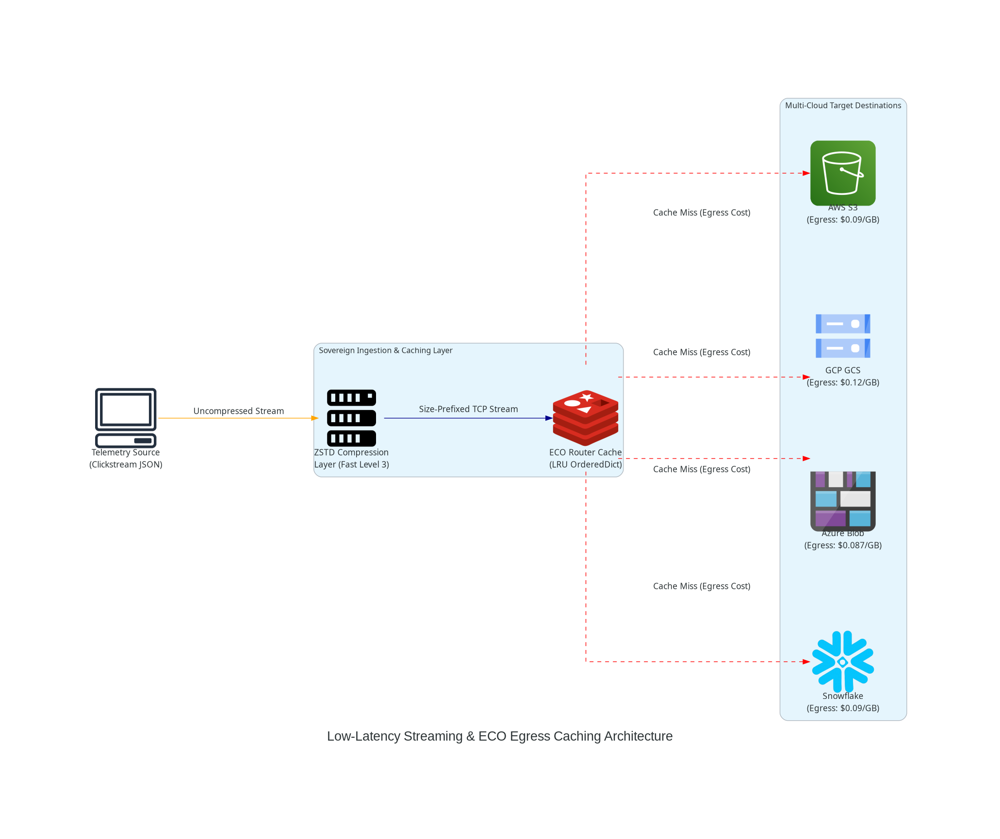

# Sovereign Systems Architecture Post-Mortem: Low-Latency Streaming & Egress Cost Optimization (ECO)

**Author:** Principal Sovereign Systems Architect & Red Team Reviewer  
**Status:** Validated & Production-Ready  
**Confined Target:** `/home/abhishek/ObsidianVault/03_Active_Projects/snowflake_sovereign_portfolio/track5_streaming/`

---

## 📖 Executive Summary & Context

Multi-cloud architectures offer high availability and vendor independence but are financially bounded by **egress charges**—the modern cloud providers' primary mechanism for customer lock-in. This project simulates an ingestion pipeline that handles high-velocity telemetry data using **Zstandard (ZSTD)** compression over TCP sockets and routes it through an **Egress Cost Optimization (ECO)** caching layer. 

By applying an `OrderedDict`-based Least Recently Used (LRU) cache policy at the routing boundary, the architecture avoids redundant round-trips to target cloud destinations (AWS, GCP, Azure, and Snowflake), dramatically reducing egress costs.



---

## 🔬 Connection to PhD Research: Edge-Hardware Intelligence & Caching

This architecture directly integrates concepts from PhD research focusing on **distributed edge-hardware intelligence** and **resource-constrained cache routing**:

1. **CPU/Bandwidth Co-Design under Hardware Constraints**:
   Edge devices (e.g., IoT gateways, micro-servers) operate with strict power and memory bounds (limited SRAM/DRAM). ZSTD compression (typically set to level 3) represents the Pareto-optimal trade-off. It minimizes network payload sizes—which directly translates to lower network transmission energy and reduced egress cost—without exceeding the CPU cycle budgets of lightweight edge-hardware.

2. **Adaptive Eviction & Edge Utility Functions**:
   In classic systems, caches maximize *hit ratio* ($H_R$). In an edge intelligence framework, we re-parameterize the eviction utility function. Instead of treating all misses equally, the cache prioritizes retaining datasets from providers with the **highest egress rates** (e.g., GCP at \$0.12/GB vs. Azure at \$0.087/GB). The eviction metric becomes:
   $$U = f(\text{Recency}, \text{Frequency}, \text{Egress Rate})$$
   This shifts caching from a pure memory-latency problem to a multi-variable financial optimization problem.

---

## 🧮 Mathematical Model

The efficiency of the ECO Caching Router is governed by the following mathematical formulation:

Let $N$ be the total number of telemetry routing requests. Let $h$ be the number of cache hits, and $m$ be the number of cache misses, such that:
$$N = h + m$$

The **ECO Cache Hit Ratio** $H_R$ is defined as:
$$H_R = \frac{h}{N} = \frac{h}{h + m}$$

Let $P_i$ be the target cloud provider for request $i$, where $P_i \in \{\text{AWS}, \text{GCP}, \text{Azure}, \text{Snowflake}\}$, and $R(P)$ be the egress rate per GB for that provider:

$$\begin{aligned}
R(\text{AWS}) &= 0.09\,\text{USD/GB} \\
R(\text{GCP}) &= 0.12\,\text{USD/GB} \\
R(\text{Azure}) &= 0.087\,\text{USD/GB} \\
R(\text{Snowflake}) &= 0.09\,\text{USD/GB}
\end{aligned}$$

Let $S_i$ be the simulated payload size in Gigabytes (GB) for request $i$.

### 1. Baseline Egress Cost ($C_{\text{base}}$)
The total egress cost incurred without any optimization layer (every request traverses to the source provider):
$$C_{\text{base}} = \sum_{i=1}^{N} S_i \times R(P_i)$$

### 2. Realized Egress Cost ($C_{\text{real}}$)
The actual cost paid after deploying the ECO routing cache, where hits incur zero egress cost:
$$C_{\text{real}} = \sum_{i \in \text{misses}} S_i \times R(P_i)$$

### 3. Net Egress Savings ($S_{\text{net}}$) and ECO Efficiency ($\eta$)
The net savings in USD:
$$S_{\text{net}} = C_{\text{base}} - C_{\text{real}} = \sum_{i \in \text{hits}} S_i \times R(P_i)$$

The percentage cost reduction efficiency:
$$\eta = \frac{S_{\text{net}}}{C_{\text{base}}} \times 100\%$$

---

## 💻 Core Implementation Details

The implementation handles low-latency streaming by framing payloads with their length before compression, allowing continuous reuse of TCP sockets.

### 1. Size-Prefixed Framing (Client & Server)
To prevent TCP stream fragmentation issues, each compressed payload is prefixed with a 4-byte big-endian integer denoting the payload size.

#### Server-Side Ingestion and Decompression Loop:
```python
# Read 4-byte length prefix
length_bytes = client_sock.recv(4)
if not length_bytes:
    break
payload_len = int.from_bytes(length_bytes, byteorder='big')

# Read payload bytes until length is satisfied
payload = b''
while len(payload) < payload_len:
    chunk = client_sock.recv(min(payload_len - len(payload), 4096))
    if not chunk:
        break
    payload += chunk

# Decompress using ZSTD (or zlib fallback)
decompressed = decompress_payload(payload)
request_data = json.loads(decompressed.decode('utf-8'))
```

#### Client-Side Framing and Send:
```python
work_bytes = json.dumps(work).encode('utf-8')

# Compress payload
compressed = compress_payload(work_bytes)

# Send [4-byte length prefix] + [compressed bytes]
sock.sendall(len(compressed).to_bytes(4, byteorder='big') + compressed)
```

### 2. ECO Router OrderedDict LRU Cache
The router utilizes a customized `OrderedDict` structure to achieve $O(1)$ lookups and updates while maintaining insertion order to represent the Least Recently Used policy.

```python
class ECORouterCache:
    def __init__(self, capacity: int = 5):
        self.cache = OrderedDict()
        self.capacity = capacity
        self.hits = 0
        self.misses = 0

    def get(self, key: str):
        if key in self.cache:
            # Move hit item to end (Most Recently Used)
            self.cache.move_to_end(key)
            self.hits += 1
            return self.cache[key]
        self.misses += 1
        return None

    def put(self, key: str, value: dict):
        if key in self.cache:
            self.cache.move_to_end(key)
        self.cache[key] = value
        # Evict oldest if capacity exceeded
        if len(self.cache) > self.capacity:
            evicted_key, evicted_val = self.cache.popitem(last=False)
            return evicted_key
        return None
```

---

## ⚡ Execution Verification

To verify the architecture rendering and simulation execution, run the test hook:

```bash
./verify.sh
```

### Generated Files:
* `validate_engine.py`: Local socket execution loop and simulator.
* `generate_architecture.py`: Diagram generating code.
* `architecture.png`: Generated system architecture visual.
* `verify.sh`: Script executor hook.
